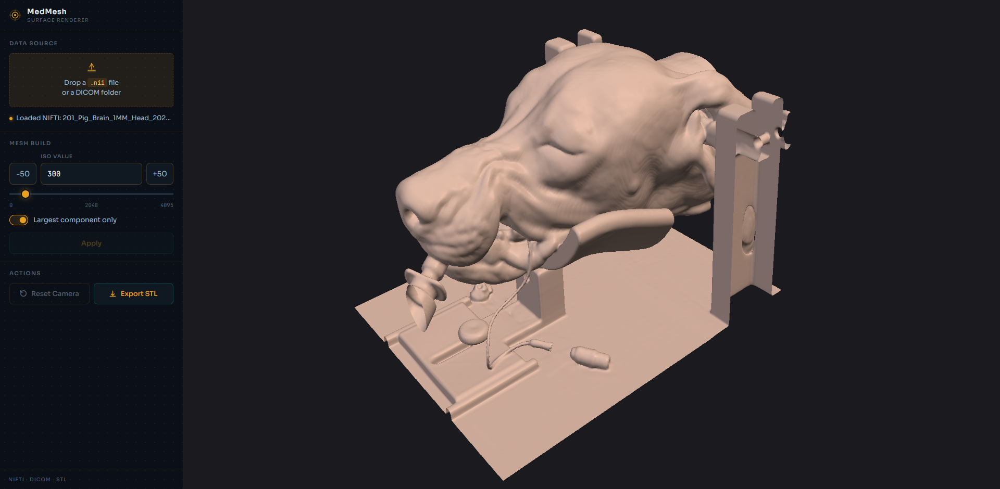

# MedMesh

Turn medical imaging volumes into 3D surfaces, right in your browser.

Drop a NIFTI (`.nii`) file or a folder of DICOM slices, tweak the iso-value, and get an interactive 3D iso-surface — powered by VTK's Flying Edges algorithm compiled to WebAssembly. No server, no install, no HIPAA nightmares.

**[Try the live demo](https://changmin-chen.github.io/MedMesh/)**

## Features

- **NIFTI + DICOM** — load `.nii` volumes or drag-and-drop a DICOM folder
- **Real-time iso-surfacing** — Flying Edges 3D runs entirely client-side via WASM
- **STL export** — save the generated mesh for 3D printing or downstream tools
- **Zero backend** — everything runs in-browser; your data never leaves your machine

## How it works

C++ (VTK) → Emscripten → WebAssembly → vanilla JS frontend. The VTK rendering pipeline (reader → Flying Edges → mapper → actor) lives in C++ and is exposed to JS through Embind. File I/O goes through Emscripten's virtual filesystem.

## Building from source

See [BUILDING.md](BUILDING.md).

## License

MIT
